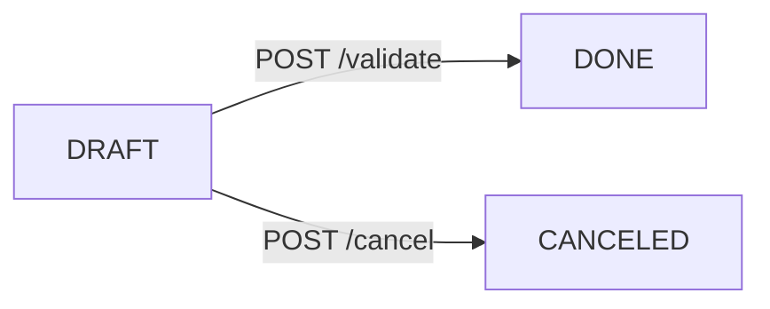

# StockSense API Documentation

## System Health

### Get Health Status

Checks the operational status of the StockSense API backend.

- **URL:** `/api/health`
- **Method:** `GET`
- **Authentication:** None
- **Response Headers:** `Content-Type: application/json`

#### Success Response (200 OK)

```json
{
  "status": "ok",
  "app_name": "StockSense API",
  "environment": "development"
}
```

---

## Authentication & Authorization (`/api/auth`)

### Bearer Authentication
Endpoints requiring authentication expect an HTTP `Authorization` header formatted as:
```text
Authorization: Bearer <access_token>
```

### Roles & RBAC
System operations are restricted based on user roles:
- `INVENTORY_MANAGER`: Complete administrative and managerial access across categories, products, warehouses, locations, and inventory.
- `WAREHOUSE_STAFF`: Read-only access for master data and stock availability queries.

---

### 1. User Signup
Registers a new user account with a specified role.

- **URL:** `/api/auth/signup`
- **Method:** `POST`
- **Authentication:** None

#### Request Body
```json
{
  "name": "Akhil",
  "email": "user@example.com",
  "phone": "+1234567890",
  "password": "SecurePassword123!",
  "role": "INVENTORY_MANAGER"
}
```

#### Response (201 Created)
```json
{
  "id": 1,
  "name": "Akhil",
  "email": "user@example.com",
  "phone": "+1234567890",
  "role": "INVENTORY_MANAGER",
  "is_active": true,
  "created_at": "2026-09-26T10:00:00Z",
  "updated_at": "2026-09-26T10:00:00Z"
}
```

---

### 2. User Login
Authenticates user credentials and issues a JWT access token.

- **URL:** `/api/auth/login`
- **Method:** `POST`
- **Authentication:** None

#### Request Body
```json
{
  "email": "user@example.com",
  "password": "SecurePassword123!"
}
```

#### Response (200 OK)
```json
{
  "access_token": "eyJhbGciOiJIUzI1NiIsInR5cCI6IkpXVCJ9...",
  "token_type": "bearer",
  "user": {
    "id": 1,
    "name": "Akhil",
    "email": "user@example.com",
    "phone": "+1234567890",
    "role": "INVENTORY_MANAGER",
    "is_active": true,
    "created_at": "2026-09-26T10:00:00Z",
    "updated_at": "2026-09-26T10:00:00Z"
  }
}
```

---

### 3. Current User Profile
Retrieves the profile of the currently authenticated active user.

- **URL:** `/api/auth/me`
- **Method:** `GET`
- **Authentication:** Bearer Token required

#### Response (200 OK)
```json
{
  "id": 1,
  "name": "Akhil",
  "email": "user@example.com",
  "phone": "+1234567890",
  "role": "INVENTORY_MANAGER",
  "is_active": true,
  "created_at": "2026-09-26T10:00:00Z",
  "updated_at": "2026-09-26T10:00:00Z"
}
```

---

### 4. User Logout
Stateless logout notification endpoint.

- **URL:** `/api/auth/logout`
- **Method:** `POST`
- **Authentication:** Bearer Token required

#### Response (200 OK)
```json
{
  "message": "Logged out successfully. Please discard the access token on the client side."
}
```

---

### 5. Forgot Password (OTP Generation)
Initiates the 6-digit numeric OTP password reset process.

- **URL:** `/api/auth/forgot-password`
- **Method:** `POST`
- **Authentication:** None

#### Request Body
```json
{
  "email": "user@example.com"
}
```

#### Response (200 OK)
```json
{
  "message": "If the email is registered, a password reset OTP has been generated."
}
```

---

### 6. Verify OTP
Verifies the 6-digit OTP code and returns a short-lived password reset token.

- **URL:** `/api/auth/verify-otp`
- **Method:** `POST`
- **Authentication:** None

#### Request Body
```json
{
  "email": "user@example.com",
  "otp": "123456"
}
```

#### Response (200 OK)
```json
{
  "reset_token": "eyJhbGciOiJIUzI1NiIsInR5cCI6IkpXVCJ9...",
  "token_type": "bearer",
  "message": "OTP verified successfully."
}
```

---

### 7. Reset Password
Resets user password using the short-lived password reset token.

- **URL:** `/api/auth/reset-password`
- **Method:** `POST`
- **Authentication:** None

#### Request Body
```json
{
  "reset_token": "eyJhbGciOiJIUzI1NiIsInR5cCI6IkpXVCJ9...",
  "new_password": "NewSecurePassword123!"
}
```

#### Response (200 OK)
```json
{
  "message": "Password has been reset successfully."
}
```

---

## Categories (`/api/categories`)

- **POST `/api/categories`**: Create category (`INVENTORY_MANAGER` only). Body: `{"name": "Metals", "description": "Raw metals"}` (201 Created).
- **GET `/api/categories`**: List categories (Authenticated). Query params: `?search=...`, `?is_active=true`.
- **GET `/api/categories/{id}`**: Get category details by ID (Authenticated).
- **PATCH `/api/categories/{id}`**: Update category (`INVENTORY_MANAGER` only). Body: `{"name": "...", "description": "...", "is_active": true}`.
- **DELETE `/api/categories/{id}`**: Deactivate category (`INVENTORY_MANAGER` only, soft-delete).

---

## Warehouses (`/api/warehouses`)

- **POST `/api/warehouses`**: Create warehouse (`INVENTORY_MANAGER` only). Body: `{"name": "Central Hub", "code": "WH-01", "address": "...", "manager_id": 1}` (201 Created).
- **GET `/api/warehouses`**: List warehouses (Authenticated). Query params: `?search=...`, `?is_active=true`.
- **GET `/api/warehouses/{id}`**: Get warehouse details by ID (Authenticated).
- **PATCH `/api/warehouses/{id}`**: Update warehouse (`INVENTORY_MANAGER` only).
- **DELETE `/api/warehouses/{id}`**: Deactivate warehouse (`INVENTORY_MANAGER` only, soft-delete).

---

## Locations (`/api/locations`)

- **POST `/api/locations`**: Create location (`INVENTORY_MANAGER` only). Body: `{"warehouse_id": 1, "name": "Aisle A1", "code": "LOC-A1", "location_type": "internal"}` (201 Created).
- **GET `/api/locations`**: List locations (Authenticated). Query params: `?warehouse_id=1`, `?search=...`, `?is_active=true`.
- **GET `/api/locations/{id}`**: Get location details by ID (Authenticated).
- **PATCH `/api/locations/{id}`**: Update location (`INVENTORY_MANAGER` only).
- **DELETE `/api/locations/{id}`**: Deactivate location (`INVENTORY_MANAGER` only, soft-delete).

---

## Products (`/api/products`)

- **POST `/api/products`**: Create product master (`INVENTORY_MANAGER` only). Body: `{"name": "Steel Bolt", "sku": "SKU-BOLT-01", "category_id": 1, "unit_of_measure": "pcs", "reorder_level": "10.0000", "reorder_quantity": "50.0000"}` (201 Created).
  *Note: Direct initial stock setup via POST /api/products is deferred to the centralized InventoryService.*
- **GET `/api/products`**: List products (Authenticated). Query params: `?search=...`, `?sku=...`, `?category_id=1`, `?is_active=true`.
- **GET `/api/products/{id}`**: Get product by ID (Authenticated).
- **PATCH `/api/products/{id}`**: Update product (`INVENTORY_MANAGER` only).
- **DELETE `/api/products/{id}`**: Deactivate product (`INVENTORY_MANAGER` only, soft-delete).
- **GET `/api/products/{id}/stock`**: Read-only aggregated stock availability across locations for product (Authenticated).

---

## Inventory Availability (Read-Only) (`/api/inventory`)

- **GET `/api/inventory`**: Query read-only stock availability across products, locations, and warehouses (Authenticated).
  Query params: `?warehouse_id=1`, `?location_id=1`, `?product_id=1`, `?category_id=1`, `?low_stock=true`, `?out_of_stock=true`.
- **GET `/api/inventory/{product_id}/locations`**: Query location-by-location inventory for a product (Authenticated).

---

## Centralized Inventory Service Architecture (`app.services.InventoryService`)

### Architectural Overview
All stock-changing operations in StockSense must execute exclusively through `InventoryService` (`backend/app/services/inventory_service.py`).
Routers and business document workflows (Receipts, Deliveries, Transfers, Adjustments) MUST NOT independently compute or update inventory quantities or write stock ledger entries.

### Key Operational Rules & Semantics

1. **Transaction & Unit of Work Strategy**:
   - `InventoryService` methods accept an active SQLAlchemy `Session` (`db`), mutate model entities, and perform `db.flush()` to ensure IDs and state changes are visible within the session.
   - `InventoryService` DOES NOT call `db.commit()`. This allows caller workflows (e.g. approving a Receipt or Delivery document) to combine document status updates, inventory quantity changes, and stock ledger generation in a single atomic database transaction.

2. **Decimal & Precision Handling**:
   - All stock quantities (`quantity`, `reserved_quantity`, `quantity_before`, `quantity_change`, `quantity_after`) use `Decimal` with strict `Numeric(12, 4)` quantization. Floating-point arithmetic is strictly prohibited.
   - `increase_stock`, `decrease_stock`, and `transfer_stock` require strictly positive quantities (`quantity > 0`).
   - `adjust_stock` requires non-negative counted quantities (`counted_quantity >= 0`).

3. **Available Stock & Safety Guards**:
   - `available_quantity` is defined deterministically as:
     $$\text{available\_quantity} = \text{quantity} - \text{reserved\_quantity}$$
   - Stock decreases and transfers validate requested quantities against `available_quantity`. Operations that would cause available physical stock to drop below zero are rejected immediately with domain exception `InsufficientStockError`.
   - Operations that fail or throw domain exceptions perform no mutation and generate no ledger entries.

4. **Transfer Ledger Semantics**:
   - `transfer_stock` decreases source location stock and increases destination location stock in a single atomic operation, preserving total company-wide stock.
   - Transfers generate a single `StockLedger` entry with `transaction_type = TRANSFER`, capturing `source_location_id`, `destination_location_id`, source `quantity_before`, transferred `quantity_change`, and source `quantity_after`.

5. **Adjustment Semantics**:
   - `adjust_stock` accepts a physical count (`counted_quantity`) and computes:
     $$\text{quantity\_change} = \text{counted\_quantity} - \text{system\_quantity}$$
   - Adjustments verify that `counted_quantity >= reserved_quantity`. Adjustments attempting to set physical stock below reserved quantities raise `InvalidAdjustmentError`.

6. **Low-Stock Evaluation**:
   - Low-stock and out-of-stock evaluations (`check_low_stock`) check location-specific `ReorderRule` records first, then product-wide `ReorderRule` records, falling back to `Product.reorder_level`.
   - Low Stock Condition: $\text{available\_quantity} \le \text{reorder\_level}$
   - Out of Stock Condition: $\text{available\_quantity} \le 0$

---

## Receipts / Incoming Stock (`/api/receipts`)

### Overview & Workflow
The Receipts API manages incoming stock workflows. All stock increases are executed strictly through the centralized `InventoryService.increase_stock` method during receipt validation.

### Status Lifecycle
- `DRAFT`: Initial state upon creation. Fully editable. Does not change inventory or create stock ledgers.
- `DONE`: Final validated state. Immutable. Inventory stock increased by `received_quantity` and RECEIPT stock ledger entry generated. Cannot be edited, validated again, or canceled.
- `CANCELED`: Terminal canceled state. Cannot be edited or validated. Does not alter inventory stock.



### Authorization
- `INVENTORY_MANAGER`: Complete access (create, list, detail, edit draft, validate, cancel).
- `WAREHOUSE_STAFF`: Complete operational access (create, list, detail, edit draft, validate, cancel).
- Unauthenticated: Returns `401 Unauthorized`.

---

### 1. Create Receipt
Creates a new incoming receipt in `DRAFT` status.

- **URL:** `/api/receipts`
- **Method:** `POST`
- **Authentication:** Bearer Token required (`INVENTORY_MANAGER`, `WAREHOUSE_STAFF`)

#### Request Body Example
```json
{
  "supplier": "Hyderabad Steel Suppliers",
  "location_id": 1,
  "items": [
    {
      "product_id": 1,
      "quantity": "100.0000",
      "received_quantity": "100.0000"
    }
  ]
}
```

#### Validation Rules
- `created_by`: Derived from JWT authenticated user token.
- `location_id`: Must exist and be active. Associated warehouse must be active.
- `items`: At least 1 item required. Duplicate products in items list rejected.
- `quantity`: Must be > 0.
- `received_quantity`: Must be >= 0 and <= `quantity`.

#### Success Response (201 Created)
```json
{
  "id": 1,
  "receipt_number": "RCV-20260926-0001",
  "supplier": "Hyderabad Steel Suppliers",
  "location_id": 1,
  "location_name": "Receiving Bay",
  "warehouse_id": 1,
  "warehouse_name": "Central Hub",
  "status": "DRAFT",
  "created_by": 1,
  "created_at": "2026-09-26T13:00:00Z",
  "updated_at": "2026-09-26T13:00:00Z",
  "items": [
    {
      "id": 1,
      "receipt_id": 1,
      "product_id": 1,
      "product_name": "Steel Rods",
      "sku": "STEEL-001",
      "quantity": "100.0000",
      "received_quantity": "100.0000"
    }
  ]
}
```

---

### 2. List Receipts
Lists receipts ordered newest first.

- **URL:** `/api/receipts`
- **Method:** `GET`
- **Authentication:** Bearer Token required
- **Query Parameters:**
  - `status`: Filter by `DRAFT`, `DONE`, `CANCELED`
  - `location_id`: Filter by destination location ID
  - `warehouse_id`: Filter by warehouse ID
  - `supplier`: Case-insensitive substring match on supplier
  - `search`: Substring search on `receipt_number` or `supplier`
  - `created_by`: Filter by creator user ID

#### Success Response (200 OK)
```json
[
  {
    "id": 1,
    "receipt_number": "RCV-20260926-0001",
    "supplier": "Hyderabad Steel Suppliers",
    "location_id": 1,
    "location_name": "Receiving Bay",
    "warehouse_id": 1,
    "warehouse_name": "Central Hub",
    "status": "DRAFT",
    "created_by": 1,
    "created_at": "2026-09-26T13:00:00Z",
    "updated_at": "2026-09-26T13:00:00Z",
    "items": [
      {
        "id": 1,
        "receipt_id": 1,
        "product_id": 1,
        "product_name": "Steel Rods",
        "sku": "STEEL-001",
        "quantity": "100.0000",
        "received_quantity": "100.0000"
      }
    ]
  }
]
```

---

### 3. Get Receipt Detail
Retrieves full details of a receipt by ID.

- **URL:** `/api/receipts/{receipt_id}`
- **Method:** `GET`
- **Authentication:** Bearer Token required

---

### 4. Update Receipt (DRAFT only)
Updates supplier, location, or item lines of a `DRAFT` receipt.

- **URL:** `/api/receipts/{receipt_id}`
- **Method:** `PATCH`
- **Authentication:** Bearer Token required (`INVENTORY_MANAGER`, `WAREHOUSE_STAFF`)

---

### 5. Validate Receipt
Validates a receipt and executes stock increases via `InventoryService.increase_stock` inside a single database transaction.

- **URL:** `/api/receipts/{receipt_id}/validate`
- **Method:** `POST`
- **Authentication:** Bearer Token required (`INVENTORY_MANAGER`, `WAREHOUSE_STAFF`)

#### Transaction & Idempotency Behavior
1. Validates status is `DRAFT`. If already `DONE` or `CANCELED`, returns `400 Bad Request`.
2. Validates location, warehouse, and all line products are active.
3. Requires at least one line item to have `received_quantity > 0`.
4. For each item with `received_quantity > 0`, calls `InventoryService.increase_stock(...)`:
   - `transaction_type`: `RECEIPT`
   - `reference_id`: `receipt.id`
   - `performed_by`: authenticated `current_user.id`
   - `quantity_change`: `+item.received_quantity`
5. Sets status to `DONE`.
6. Commits transaction once. On any failure, full rollback occurs (no stock increase, no ledger created, status remains `DRAFT`).

---

### 6. Cancel Receipt
Cancels a `DRAFT` receipt.

- **URL:** `/api/receipts/{receipt_id}/cancel`
- **Method:** `POST`
- **Authentication:** Bearer Token required (`INVENTORY_MANAGER`, `WAREHOUSE_STAFF`)

#### Behavior
- Updates status to `CANCELED`.
- Does not change inventory stock or create stock ledger records.
- If receipt is already `DONE` or `CANCELED`, returns `400 Bad Request`.

---

## Deliveries / Outgoing Stock (`/api/deliveries`)

### Overview & Delivery Lifecycle
Deliveries handle outgoing inventory movements from a source location.
Supported statuses: `DRAFT`, `WAITING`, `READY`, `PICKED`, `PACKED`, `DONE`, `CANCELED`.

- **Stock Mutation Policy:** DRAFT, WAITING, READY, PICKED, and PACKED status documents do NOT mutate inventory stock or create `StockLedger` entries.
- **Reservation Policy:** Deliveries do not create or own inventory reservations in this iteration. Final validation checks available physical stock (`available = quantity - reserved_quantity`).
- **Validation:** `POST /api/deliveries/{id}/validate` atomically decreases stock via `InventoryService.decrease_stock()` using row locking (`SELECT ... FOR UPDATE`), transitions status to `DONE`, and generates negative `DELIVERY` stock ledger records.
- **Immutability:** `DONE` and `CANCELED` states are terminal and immutable.

### Operational Roles
Both `INVENTORY_MANAGER` and `WAREHOUSE_STAFF` roles can create, update, validate, and cancel delivery documents.

---

### 1. Create Delivery
Creates a new delivery document in `DRAFT` status.

- **URL:** `/api/deliveries`
- **Method:** `POST`
- **Authentication:** Bearer Token required (`INVENTORY_MANAGER`, `WAREHOUSE_STAFF`)

#### Request Body
```json
{
  "customer_reference": "PO-98765",
  "location_id": 1,
  "items": [
    {
      "product_id": 1,
      "quantity": "25.5000"
    }
  ]
}
```

#### Success Response (201 Created)
```json
{
  "id": 1,
  "delivery_number": "DLV-20260926-0001",
  "customer_reference": "PO-98765",
  "location_id": 1,
  "location_name": "Dispatch Dock A",
  "warehouse_id": 1,
  "warehouse_name": "Central Hub",
  "status": "DRAFT",
  "created_by": 1,
  "created_at": "2026-09-26T14:00:00Z",
  "updated_at": "2026-09-26T14:00:00Z",
  "items": [
    {
      "id": 1,
      "delivery_id": 1,
      "product_id": 1,
      "product_name": "Steel Rods",
      "sku": "STEEL-001",
      "quantity": "25.5000"
    }
  ]
}
```

---

### 2. List Deliveries
Lists deliveries ordered by newest first.

- **URL:** `/api/deliveries`
- **Method:** `GET`
- **Authentication:** Bearer Token required
- **Query Parameters:**
  - `status`: Filter by status (`DRAFT`, `WAITING`, `READY`, `PICKED`, `PACKED`, `DONE`, `CANCELED`)
  - `location_id`: Filter by source location ID
  - `warehouse_id`: Filter by warehouse ID
  - `customer_reference`: Case-insensitive substring match on customer reference
  - `search`: Substring search on `delivery_number` or `customer_reference`
  - `created_by`: Filter by creator user ID

#### Success Response (200 OK)
```json
[
  {
    "id": 1,
    "delivery_number": "DLV-20260926-0001",
    "customer_reference": "PO-98765",
    "location_id": 1,
    "location_name": "Dispatch Dock A",
    "warehouse_id": 1,
    "warehouse_name": "Central Hub",
    "status": "DRAFT",
    "created_by": 1,
    "created_at": "2026-09-26T14:00:00Z",
    "updated_at": "2026-09-26T14:00:00Z",
    "items": [
      {
        "id": 1,
        "delivery_id": 1,
        "product_id": 1,
        "product_name": "Steel Rods",
        "sku": "STEEL-001",
        "quantity": "25.5000"
      }
    ]
  }
]
```

---

### 3. Get Delivery Detail
Retrieves full details of a delivery by ID.

- **URL:** `/api/deliveries/{delivery_id}`
- **Method:** `GET`
- **Authentication:** Bearer Token required

---

### 4. Update Delivery (Pre-Terminal)
Updates customer reference, location, operational status, or item lines of a pre-terminal delivery.

- **URL:** `/api/deliveries/{delivery_id}`
- **Method:** `PATCH`
- **Authentication:** Bearer Token required (`INVENTORY_MANAGER`, `WAREHOUSE_STAFF`)

#### Operational Rules:
- Direct status update to `DONE` or `CANCELED` via `PATCH` is rejected. Use `/validate` or `/cancel`.
- `DONE` and `CANCELED` documents cannot be updated.

---

### 5. Validate Delivery
Validates a pre-terminal delivery and executes stock deductions via `InventoryService.decrease_stock` inside a single database transaction.

- **URL:** `/api/deliveries/{delivery_id}/validate`
- **Method:** `POST`
- **Authentication:** Bearer Token required (`INVENTORY_MANAGER`, `WAREHOUSE_STAFF`)

#### Transaction & Idempotency Behavior:
1. Loads Delivery row with PostgreSQL-safe row-level lock (`SELECT ... FOR UPDATE`).
2. Verifies status allows final validation. If already `DONE` or `CANCELED`, returns `400 Bad Request`.
3. Validates source location, warehouse, and all line products are active.
4. For each item line, invokes `InventoryService.decrease_stock(...)`:
   - Checks available stock: `available = quantity - reserved_quantity`.
   - `transaction_type`: `DELIVERY`
   - `reference_id`: `str(delivery.id)`
   - `performed_by`: authenticated `current_user.id`
   - `quantity_change`: `-item.quantity`
5. Updates delivery status to `DONE`.
6. Commits transaction once. On insufficient stock or validation failure, complete rollback occurs (stock unchanged, no ledger created, delivery remains non-DONE).

---

### 6. Cancel Delivery
Cancels a pre-DONE delivery document.

- **URL:** `/api/deliveries/{delivery_id}/cancel`
- **Method:** `POST`
- **Authentication:** Bearer Token required (`INVENTORY_MANAGER`, `WAREHOUSE_STAFF`)

#### Behavior:
- Updates status to `CANCELED`.
- Does not change inventory stock or create stock ledger records.
- If delivery is already `DONE` or `CANCELED`, returns `400 Bad Request`.


